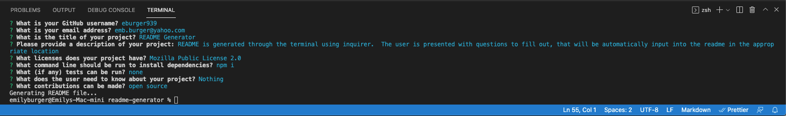
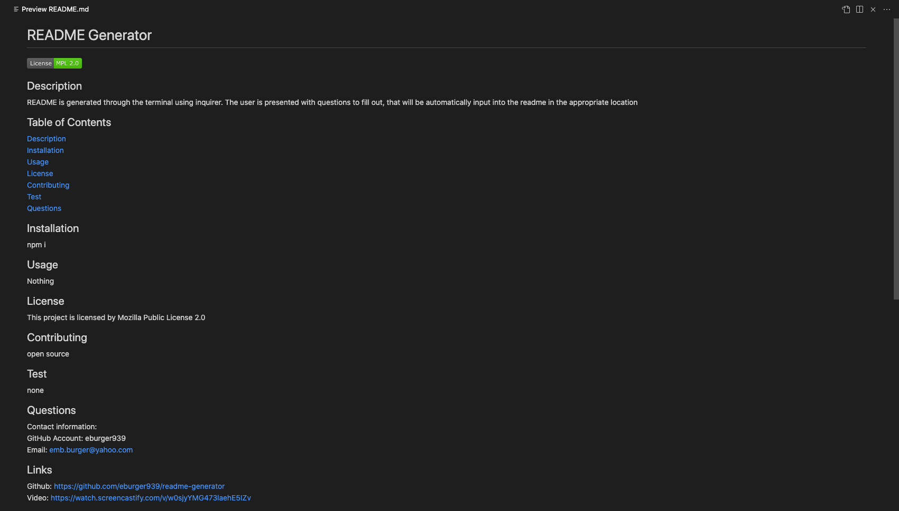

# README Generator

  

## Description
README is generated through the terminal using inquirer.  The user is presented with questions to fill out, that will be automatically input into the readme in the appropriate location

## Table of Contents
[ Description ](#desc)  
[ Installation ](#install) 
[ Usage ](#usage) 
[ License ](https://opensource.org/licenses/MPL-2.0) 
[ Contributing ](#contrib) 
[ Test ](#test) 
[ Questions ](#quest) 

## Installation

npm i

## Usage
Nothing

## License
This project is licensed by Mozilla Public License 2.0

## Contributing
open source

## Test
none

## Questions
Contact information: 
GitHub Account: eburger939 
Email: emb.burger@yahoo.com 

## Links
Github: https://github.com/eburger939/readme-generator  
Video: https://watch.screencastify.com/v/w0sjyYMG473laehE5IZv

## Screen shots

